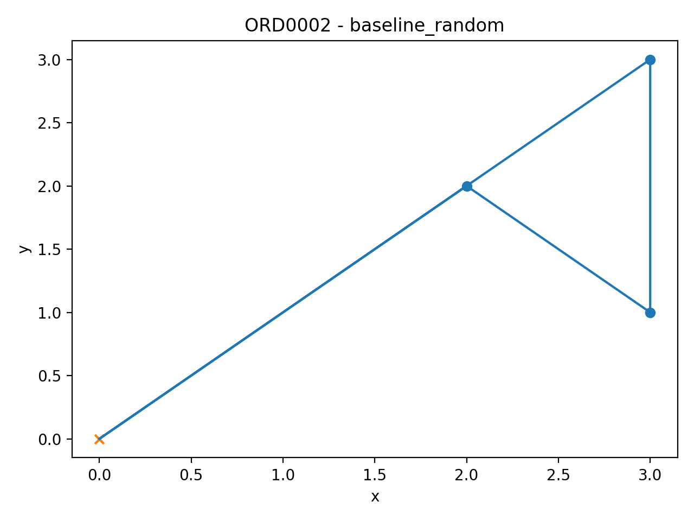
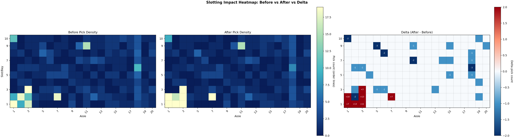
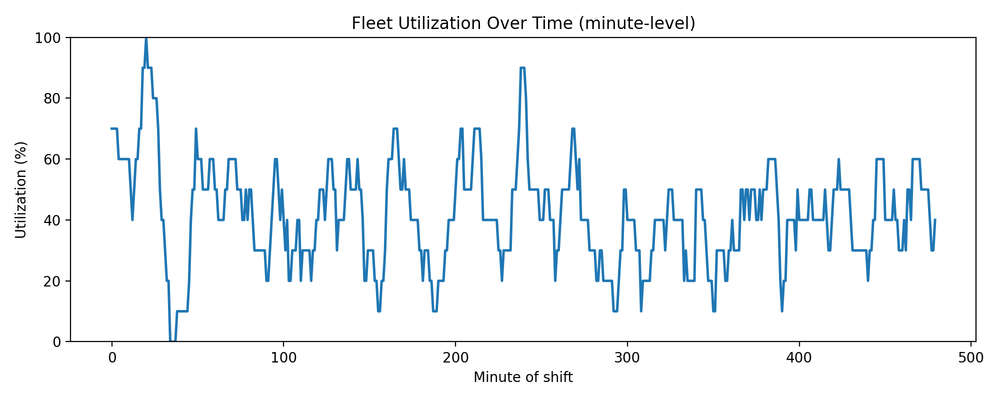
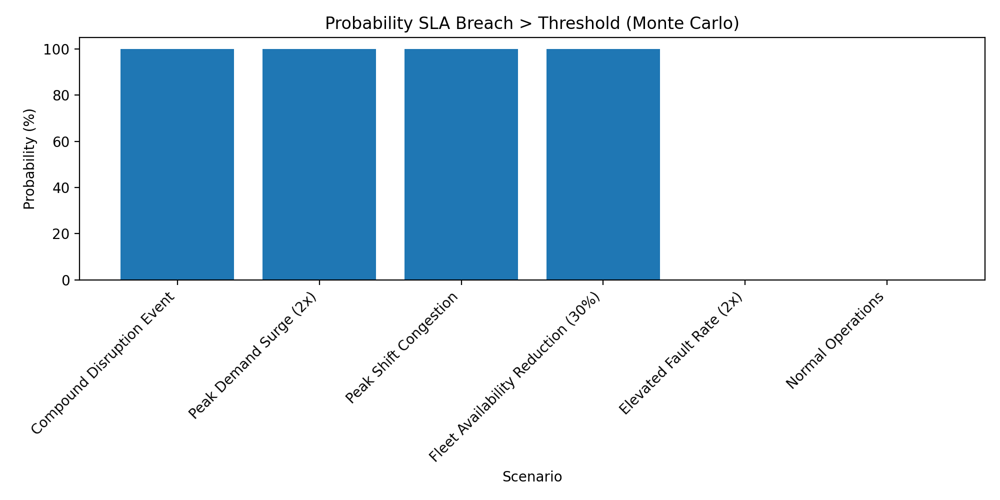

# warehouse-robotics

Warehouse Robotics Efficiency Program (simulation + analytics).

## Overview

This project simulates warehouse operations and produces portfolio-ready artifacts across:

- Week 2: pick path optimization (`src/pick_path`)
- Week 3: slotting optimization (`src/slotting`)
- Week 4: operations KPIs, alerts, and ops brief (`src/operations`)
- Week 5: audit-ready evidence pack (`src/audit_ready`)
- Week 6: scenario risk simulation (`src/scenarios`)
- Week 7: portfolio packaging and dashboard (`src/portfolio`)

## Requirements

1. Python 3.11+ (recommended)
2. Install dependencies:

```bash
pip install -r requirements.txt
```

## Quickstart

Run the full pipeline:

```bash
python main.py
```

Useful commands:

```bash
python main.py --list
python main.py operations
python src/slotting/heatmap.py
```

Notes:

- `operations` is the current Week 4 step key.

## Key Outputs

- Reports: `output/reports`
- Charts: `output/charts`
- Audit evidence: `output/audit`
- Portfolio dashboard: `output/portfolio/dashboard.html`
- Week 4 logs: `output/operations_data/simulated/robot_logs.csv`
- Canonical logs for downstream modules: `data/simulated/robot_logs.csv`

## Visual Preview

Run `python main.py` first to generate the latest images.

| Pick Path Baseline                                      | Slotting Impact                                                       |
| ------------------------------------------------------- | --------------------------------------------------------------------- |
|  |  |

| Operations Utilization                                             | Scenario Risk (SLA Breach)                                          |
| ------------------------------------------------------------------ | ------------------------------------------------------------------- |
|  |  |

## Project Structure

- `main.py`: orchestrates all pipeline steps
- `src/`: pipeline modules by week/domain
- `data/simulated/`: input and canonical simulated data
- `output/`: generated reports, charts, audit files, and portfolio
- `artifacts/project/`: charter and changelog

## Project Management

- Jira timeline/project board: https://dezsokovi.atlassian.net/jira/core/projects/WOP/timeline?rangeMode=weeks&atlOrigin=eyJpIjoiYjE3ZDY4OGM4ZjFlNGMyODgxMjg2ODc4OWJmZDUxNDQiLCJwIjoiaiJ9
- Access note: a Jira/Atlassian account with permission to this workspace is required to view the link.

## Credits

- Program: warehouse optimization, slotting strategy, operations analytics, audit-readiness, and scenario risk simulation.
- Code: Python, pandas, numpy, matplotlib.
- Core pipeline modules: `src/pick_path`, `src/slotting`, `src/operations`, `src/audit_ready`, `src/scenarios`, `src/portfolio`.
- Portfolio packaging and dashboard generation: `src/portfolio/portfolio.py`.
- Additional project credits/help page: `output/portfolio/credits.html`.
- CodeX: bug fixes and to streamline quick typo's
