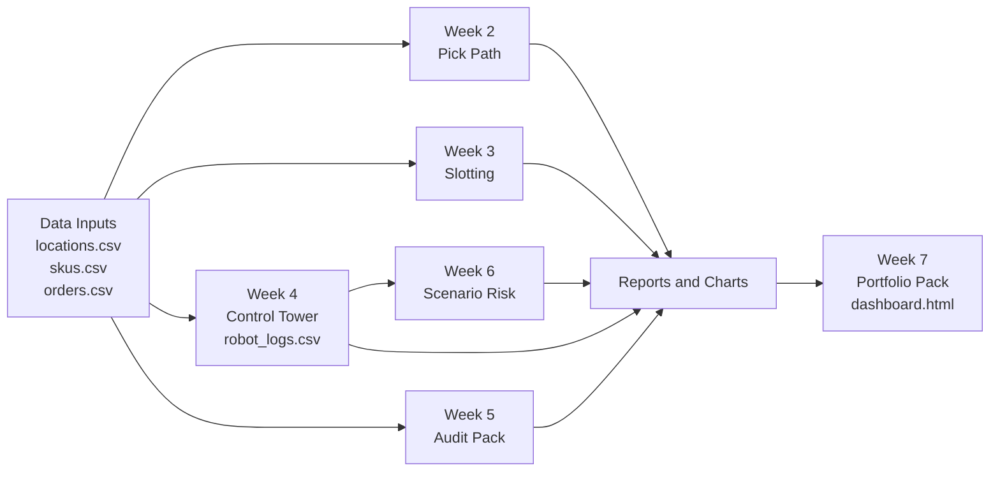

# Architecture



## Pipeline order
1. `python src/pick_path/analyze_routes.py`
2. `python src/slotting/run_slotting.py`
3. `python src/control_tower/run_control_tower.py`
4. `python src/scenarios/run_scenarios.py`
5. `python src/audit_ready/run_audit_pack.py`
6. `python src/portfolio/run_portfolio_pack.py`

## Single command entrypoint
Run all steps with:

```bash
python main.py
```

## Key outputs
- `output/reports/*.csv`
- `output/charts/*.png`
- `output/audit/run_manifest.json`
- `output/portfolio/dashboard.html`
